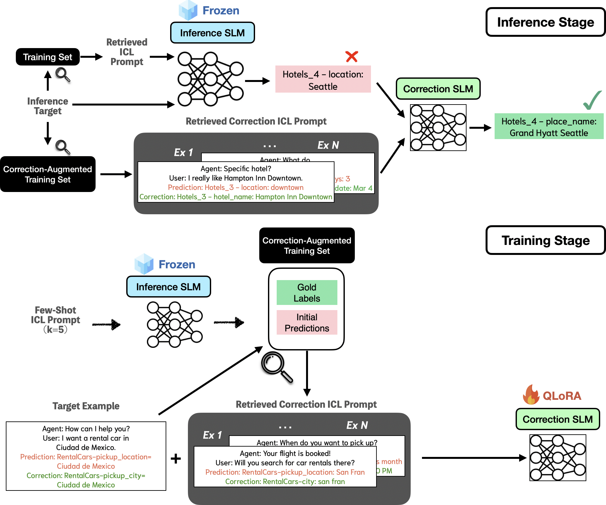

# CorrectionLM: Self-Corrections with SLM for Dialogue State Tracking
This is the original implementation of "[CorrectionLM: Self-Corrections with SLM for Dialogue State Tracking](https://arxiv.org/abs/2410.18209)" by [Chia-Hsuan Lee](https://chiahsuanlee.github.io/), [Hao Cheng](https://sites.google.com/site/hcheng2site) and [Mari Ostendorf](https://people.ece.uw.edu/ostendorf/).

<p align="center">
  
</p>

The task is to track user intents predefined by a schema (ontology) in a multi-turn conversation with an agent. 
CorrectionLM is a novel correction framework that enables Small Language Models (e.g. Llama3-8B) to self-correct using in-context exemplars without LLM (e.g. GPT-4o) involvement. 


[**Installation**](#Installation) | [**Preprocess**](#Download-and-Preprocess-Data) | [**Training**](#Training) | [**Inference**](#Inference) | | [**Evaluation**](#Evaluation) | | [**Citation**](#Citation-and-Contact)

## Installation

Create a conda environment
```console
conda env create -f env.yml 
```

## Download and Preprocess Data
To download and create the [MultiWoz 2.4](https://github.com/smartyfh/MultiWOZ2.4/) 
```console
cd data
sh preprocess_mwoz.sh
```

To download and create the [Schema-Guided Dialogue(SGD)](https://github.com/google-research-datasets/dstc8-schema-guided-dialogue)
```console
sh preprocess_sgd.sh
```


## Retriever
The trained retrievers are saved in `retriever/expts` folder. Each subfolder is a trained retriever.

### retriever quickstart
If you want to skip the retriever finetuning etc. part, 
just download one of our retriever finetuned on 5% training set and try it.
Download and unzip [mwoz_5p_SBERT.zip](https://drive.google.com/file/d/1Qwm0NAc6GRp-3xx7edeunO7umtsYwfQt/view?usp=sharing), put the folder in `retriever/expts`. (For SGD, [sgd_5p_SBERT.zip](https://drive.google.com/file/d/1KxoESMIWyAL3zLSKKBeNz3nus9wWBj_k/view?usp=sharing))

### retriever details
First embed all the utterances with SBERT (all-mpnet-base-v2) by
```console
cd retriever/code/
python pretrained_embed_index.py
```
This will save all the embeddings in `retriever/expts/all_mpnet_base_v2`.
To finetune SBERT with data in `../../data/mw24_5p_train.json`, run
```console
python retriever_finetuning.py \
--train_fn ../../data/mw24_5p_train.json \
--save_name mw24_5p_SBERT \
--epoch 15 \
--topk 10 \
--toprange 200
```
This will save the embedding model and pre-embeded selection pool to `retriever/expts/mw24_5p_SBERT`.


## Training
The first step of the training is to obtain SLM predictions using ICL in order to provide supervision signals for the correction training.

For MultiWOZ,
```console
cd runs
python runs/run_mwoz_ICL_5shot.py \
      --output_dir expts/mwoz/llama3_on_train5p_zeroshot/  \
      --lm meta-llama/Meta-Llama-3-8B-Instruct \
      --test_fn data/mw24_5p_train.json \
      --mwz_ver 2.4
```

You can also use GPT-4o for comparisons
```console
python runs/run_mwoz_ICL_5shot.py \
      --output_dir expts/mwoz/gpt4o_on_train5p_zeroshot/  \
      --lm gpt4 \
      --test_fn data/mw24_5p_train.json \
      --mwz_ver 2.4
```

For SGD,
python runs/run_sgd_ICL_5shot.py \
      --lm meta-llama/Meta-Llama-3-8B-Instruct \
      --retriever_dir retriever/expts/sgd_5p_SBERT/ \
      --output_dir expts/sgd/llama3_on_train5p_zeroshot/  \
      --test_fn data/sgd/sgd_train_5p.json

Then we create the in-context exemplars to finetune the SLM. Unlike traditional ICL methods that only consider the input and gold output, we also incoporate the model’s (erroneous) self predictions.
```

For MultiWOZ,
```console
python data/create_mwoz_llama_SFT_prompt.py \
      --train_fn expts/mwoz/llama3_on_train5p_zeroshot/running_log.json \
      --retriever_dir retriever/expts/mw24_5p/ \
      --output_fn data/mwoz/llama3_on_train5p_zeroshot_ICL_prompt.json  \
      --test_fn expts/mwoz/llama3_on_train5p_zeroshot/running_log.json \
      --mwz_ver 2.4
```

For SGD,
```console
python data/create_sgd_llama_SFT_prompt.py \
      --train_fn expts/sgd/llama3_on_train5p_zeroshot/running_log.json \
      --retriever_dir retriever/expts/sgd_5p_SBERT/ \
      --output_fn data/sgd/llama3_on_train5p_zeroshot_ICL_prompt.json  \
      --test_fn expts/sgd/llama3_on_train5p_zeroshot/running_log.json
```

The second step is to train the SLM. In order to be computation-efficient, we aadopt [QLoRA](https://arxiv.org/abs/2305.14314) for training, i.e. we quantize the SLM then insert LoRA adapaters.
For MultiWOZ, 
```console
cd runs
sh train_mwoz.sh
```
For SGD, 
```console
sh train_sgd.sh
```

## Inference
The first step of the inference is to get initial predictions by a non-finetuned SLM.

For MultiWOZ,
```console
python runs/run_mwoz_ICL_vanilla.py \
      --train_fn data/mw24_5p_train.json \
      --retriever_dir retriever/expts/mw24_5p/ \
      --lm meta-llama/Meta-Llama-3-8B-Instruct \
      --output_dir expts/mwoz/llama3_train_5p_on_test100p/  \
      --test_fn data/mw24_100p_test.json \
      --mwz_ver 2.4
```

For SGD,
python runs/run_sgd_ICL_vanilla.py \
      --train_fn data/sgd/sgd_train_5p.json \
      --retriever_dir retriever/expts/sgd_5p_SBERT/ \
      --lm meta-llama/Meta-Llama-3-8B-Instruct \
      --output_dir expts/sgd/llama3_train_5p_on_test100p/  \
      --test_fn data/sgd/sgd_test_100p.json
```

We then prompt the correction-tuned SLM (correction SLM) to refine the initial predictions made in the first step.
For MWOZ,
```console
python runs/run_mwoz_correctionlm.py \
    --train_fn expts/mwoz/llama3_on_train5p_zeroshot/running_log.json \
    --retriever_dir retriever/expts/mw24_5p/ \
    --output_dir expts/mwoz/correction_outputs/llama_example_llama_inference_train5p_test100p/  \
    --test_fn expts/mwoz/llama3_train_5p_on_test100p/running_log.json \
    --mwz_ver 2.4 \
    --model models/mwoz/sft_llama3_on_train5p_zeroshot/
```

For SGD,
python runs/run_sgd_correctionlm.py \
    --train_fn  expts/sgd/llama3_on_train5p_zeroshot/running_log.json \
    --retriever_dir retriever/expts/sgd_5p_SBERT/ \
    --output_dir expts/sgd/correction_outputs/llama_example_llama_inference_train5p_test100p/  \
    --test_fn expts/sgd/llama3_train_5p_on_test100p/running_log.json \
    --model models/sgd/sft_llama3_on_train5p_zeroshot/
```

## Evaluation
Compute the JGA and F1 for both dialogue level (DST) and turn level (TLB). 
```console
python eval/eval_result.py \
      --eval_fn expts/mwoz/correction_outputs/llama_example_llama_inference_train5p_test100p/running_log.json \
      --eval_mode second_pass # first_pass to score on the results produced by non-finetuned LM
```


## Citation and Contact

If you find our code or paper useful, please cite the paper:
```bib
```

Please contact Chia-Hsuan Lee (chiahsuan.li[at]gmail.com) for questions and suggestions.
